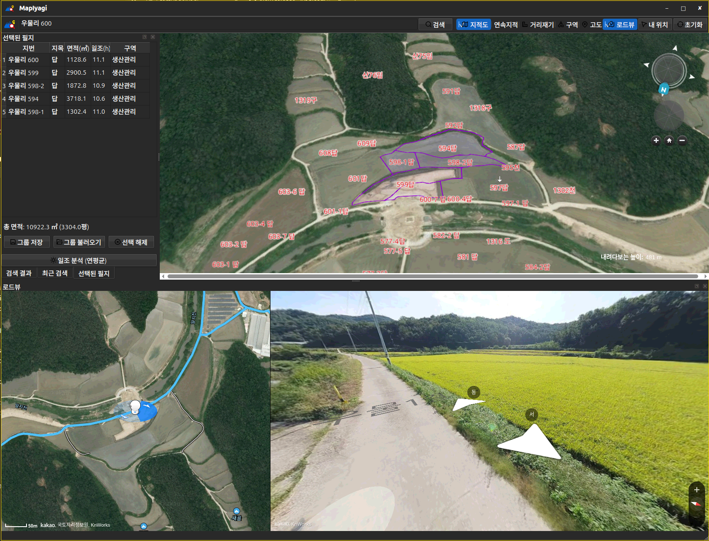

# MapIyagi v1.1.1



🗺️ **땅을 보는 지도** — 브이월드 3D 지도 위에 지적도·용도지역·일조·로드뷰를 한 화면에 올린 토지 조사 도구입니다.

필지를 클릭해 모으고, 면적과 평수를 합산하고, 태양광 일조시간을 계산하고,
그 자리의 로드뷰까지 바로 봅니다.

---

## ✨ 기능

### 지도

* **브이월드 3D 지도** — WebGL 기반 실제 지형(고도) 지도
* **주소·장소 검색** — 지번주소 / 도로명주소 / 장소명
* **최근 검색** — 100건까지 저장, 클릭하면 다시 그 자리로
* **내 위치 찾기**
* **초기화** — 여기저기 만지다 지도가 꼬였을 때 처음 상태로 되돌립니다

### 지적도

두 가지를 따로 켤 수 있습니다. 필요한 것만 보세요.

| 토글 | 보이는 것 |
|------|-----------|
| **지적도** | 지번 글씨만 |
| **연속지적** | 노란 경계선만 |

* **로컬 연속지적 DB** — `data/import_cadastral.py`로 국가공간정보포털 shapefile을
  임포트해 두면 그걸로 그립니다. 임포트 안 한 지역은 브이월드 WFS로 자동 폴백합니다
* **우클릭 → 지번 보기** — 그 자리의 지번과 고도를 띄우고, 복사하면 **시군구·읍면동·리까지
  붙은 전체 주소**가 클립보드에 들어갑니다

### 선택된 필지

필지를 클릭하면 보라색으로 표시되고 목록에 쌓입니다. 다시 클릭하면 빠집니다.

| 지번 | 지목 | 면적(㎡) | 일조(h) | 구역 |
|------|------|---------|--------|------|
| 금산리 52-5 | 답 | 1,168.0 | 4.9 | 농업진흥 |

* **총 면적 + 평수** — 목록 아래에 합계가 계속 갱신됩니다
* **행을 클릭하면 그 필지로 지도가 이동**합니다
* **리/동과 지역·지구**는 국토정보플랫폼 토지이용계획 API(`getLandUseAttr`)로 PNU마다
  조회합니다. 토지이용계획확인원과 같은 내용이라 지적 기준으로 정확합니다
* **국토계획법 밖의 법령**에 따른 지역·지구가 있으면 그것을 보여줍니다 —
  농림지역이면서 동시에 농업진흥구역인 땅은 **농업진흥구역**이 실제 규제입니다.
  칸에 마우스를 올리면 국토계획법 쪽까지 전체 목록이 나옵니다
* **그룹 저장 / 불러오기** — 모아 둔 선택을 이름 붙여 저장해 두고 나중에 그대로 복원

### 일조 분석 (태양광)

선택한 필지의 **연평균 하루 일조시간**을 계산합니다.

* NOAA 근사식으로 태양 위치(고도·방위)를 직접 계산
* 필지 중심에서 방위각별 **지형 스카이라인**(지평선 고도각)을 뽑아,
  태양이 그 위로 올라온 시간만 합산합니다 — PVsyst·SunEye 같은 태양광 부지분석
  도구와 같은 방법론입니다
* 매달 대표일을 10분 간격으로 훑어 12개월 평균
* 전체 버튼으로 한 번에, 또는 **빈 칸을 클릭해 그 필지만** 계산

> ⚠️ 지형과 임야 추정만 반영합니다. **건물·수목 그림자와 구름·기상은 들어가지 않은,
> 맑을 때의 이론상 가조시간**입니다.

### 용도구역

* 국토교통부 도시계획 표준 레이어 6종을 색 폴리곤과 라벨로 표시
  (도시지역 · 관리지역 · 농림지역 · 자연환경보전지역 · 농업진흥지역 · 개발진흥지구)
* 고도 2,000m 아래로 내려가야 표시됩니다 (그 위에서는 조각이 너무 많습니다)

### 거리재기

두 점을 클릭하면 **수평거리(m)** 와 **경사각(°)** 이 나옵니다.
경사각은 나침반 방위가 아니라 두 점의 고저차로 구한 각도입니다 —
`atan(고도차 / 수평거리)`.

### 고도

켜고 지도를 클릭하면 그 지점의 고도가 핀으로 남습니다.
화면 한쪽에는 카메라의 지면 위 고도가 계속 표시됩니다.

### 로드뷰

토글을 켜면 지도와 **반반**으로 나뉜 로드뷰 패널이 열립니다.

| 왼쪽 | 오른쪽 |
|------|--------|
| 카카오 **위성지도** + 로드뷰 도로(파란 선) | 로드뷰 화면 |

* **동동이** 아이콘이 현재 위치와 바라보는 방향을 지도 위에 표시합니다
* 지도 클릭 · 검색 · 선택된 필지 행 클릭을 **따라갑니다**
* 파노라마를 **50m → 200m → 500m** 로 넓혀 가며 찾습니다 —
  시골 필지는 필지 안에 길이 없고 몇백 미터 떨어진 도로에만 로드뷰가 있습니다
* 파란 선이 곧 촬영된 길입니다. 로드뷰가 없다고 나오면 그 선을 직접 클릭해 보세요

---

## 🔑 API 키 설정

`mapconfig.h`에서 관리합니다. 두 곳 모두 **도메인 등록**이 필요합니다.

### 브이월드

브이월드 개발자센터 > 오픈API 인증키 관리에서 허용 도메인에 `localhost:18086` 등록.

> 지도 로더가 URL의 `domain=` 파라미터를 직접 검사하기 때문에 로컬 서버 포트가
> **18086으로 고정**되어 있습니다.

### 카카오 (로드뷰)

카카오 개발자센터 > 내 애플리케이션 > 앱 설정 >
**플랫폼 키 > JavaScript 키 > JavaScript SDK 도메인** 에 등록합니다.

```
http://127.0.0.1:18086     ← 필수 (실제 Referer)
http://localhost:18086     ← 예비
```

* ⛔ **JavaScript 키**여야 합니다. 네이티브 앱 키를 넣으면 `caller=NATIVE_APP_KEY` 오류가 납니다
* ⛔ **제품 설정 > 카카오맵을 활성화**해야 합니다. 안 켜면 `disabled OPEN_MAP_AND_LOCAL service` 오류가 납니다
* ⛔ `제품 링크 관리 > 웹 도메인`은 **카카오톡 공유용**이라 여기 등록해도 효력이 없습니다

어느 단계에서 막혔는지는 이 한 줄로 바로 확인됩니다.

```bash
curl -H "Referer: http://127.0.0.1:18086/" \
     "https://dapi.kakao.com/v2/maps/sdk.js?autoload=false&appkey=<키>"
```

---

## 🛠 빌드

```bash
python3 package.py          # 버전 patch +1 후 빌드 + 패키지
python3 package.py minor    # 새 기능을 넣었을 때
```

산출물은 `build/`에 zip · deb · AppImage 세 가지가 생깁니다.
**Qt를 비롯한 모든 라이브러리가 함께 들어 있어 대상 PC에 별도 설치가 필요 없습니다.**

직접 cmake를 돌릴 때는 Qt 경로를 줘야 합니다 (배포판 Qt가 아니라 자체 설치 Qt를 씁니다).

```bash
cmake .. -DCMAKE_BUILD_TYPE=Release -DCMAKE_PREFIX_PATH=$HOME/Qt/6.11.1/gcc_64
```

### 연속지적 DB 임포트 (선택)

```bash
python3 data/import_cadastral.py   # 국가공간정보포털 LSMD_CONT_LDREG_* shapefile
```

임포트하지 않아도 동작합니다 — 브이월드 WFS로 폴백합니다.

---

## 🧱 구조

| 파일 | 역할 |
|------|------|
| `main.cpp` · `mainwindow.*` | Qt 창, 툴바, 도킹 패널, 선택된 필지 표 |
| `resources/map.html` | 브이월드 3D 지도 — 지적도·구역·거리재기·고도·일조 계산 |
| `resources/roadview.html` | 카카오 로드뷰 패널 (위성지도 + 로드뷰 도로 + 동동이) |
| `mapbridge.*` | QWebChannel 브릿지 (JS ↔ C++) |
| `localhttpserver.*` | 127.0.0.1:18086 정적 서버 — 지도 API가 도메인을 요구해서 필요합니다 |
| `cadastraldb.*` | 로컬 연속지적 SQLite 조회 |
| `vworldsearch.*` | 브이월드 검색 API |
| `mapconfig.h` | API 키·포트·경로 |

지도 페이지를 `qrc://`로 띄우지 않고 로컬 HTTP 서버로 서빙하는 이유는,
브이월드와 카카오 **둘 다 도메인(Referer)을 검사**하기 때문입니다.

---

## 🖥 지원 플랫폼

* Linux — Ubuntu 24.04 / 26.04, Debian 및 호환 배포판
* AppImage · zip은 배포판 무관

---

## 👤 제작

IYAGI INC

Email: [iyagicom@gmail.com](mailto:iyagicom@gmail.com)

GitHub: https://github.com/iyagicom
