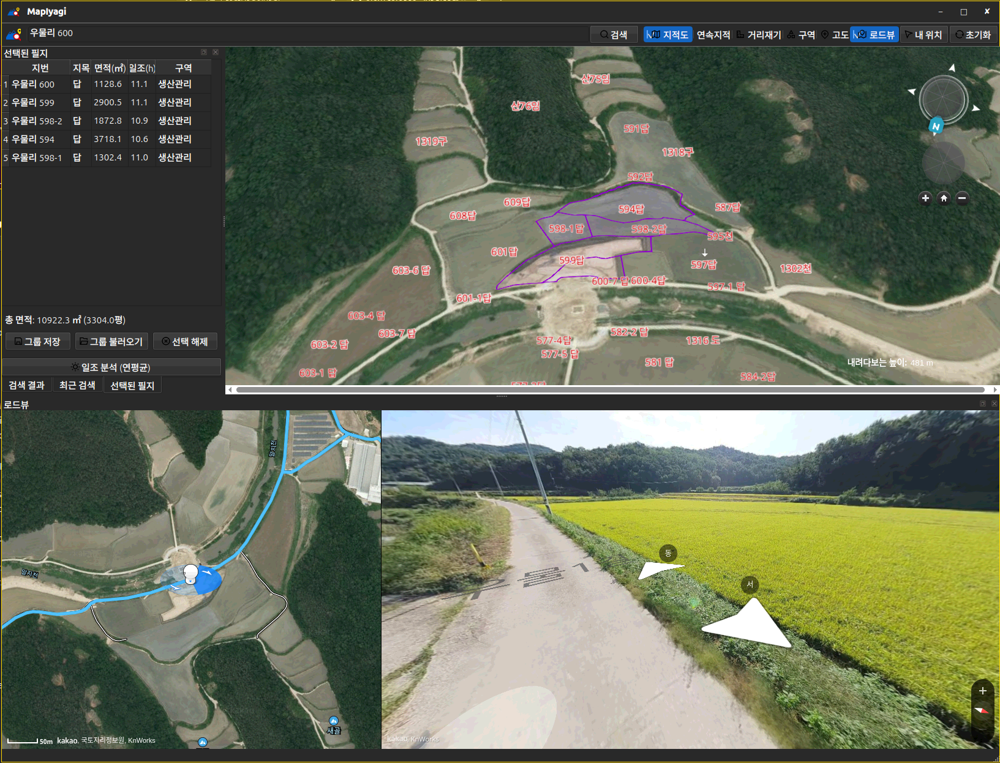

# MapIyagi

**A map for looking at land in Korea — cadastral parcels, zoning, sunlight hours, solar yield and street view on one 3D VWorld map. For land surveys and solar site hunting.**

[한국어](README.md) · [English](README_en.md)



> MapIyagi is a Korean service and its interface is in Korean. The Korean README is the reference.

## Why MapIyagi?

- **Click parcels, get the area.** Every parcel you click is added to a list with lot number, land category, area (m²), sunlight and zone — with a running **total in m² and pyeong**.
- **How much power would solar make here?** Mountains and trees within 20 km are checked against the sun every minute of the year, then the last five years of local weather, snow cover and module temperature are applied to give **kWh/kWp**. Tuned against three years of measured output from a real plant (within about 1%).
- **See the late sunrise behind an eastern ridge.** Monthly and hourly charts show at a glance whether a site is good.
- **See the rules that actually apply.** Zones are looked up per parcel from the official land-use plan, and the one that really restricts the land is shown first.
- **Look without driving there.** Street view opens side by side with the map and searches nearby roads, even for rural parcels with no road of their own.

## Features

- VWorld 3D map; search by lot address, road address or place; recent searches; my location
- Cadastral lot numbers and boundaries as separate toggles; right-click for lot number, elevation and full address
- Selected-parcel list with totals; searched parcel in red, clicked parcels in purple; save and restore parcel groups; remove only the rows you pick
- Sunlight and solar yield: 20 km horizon from Copernicus 30 m surface data, 1-minute sun tracking, NASA POWER daily weather (5 years), snow cover, module temperature coefficient, panel tilt / azimuth / row spacing with inter-row shading, monthly and hourly charts
- Nearby trees from ESA WorldCover land cover, with tree height and clearing distance set separately for east, south and west
- Zoning layers: urban, management, agricultural/forest, nature conservation, farmland promotion, development promotion
- Distance, slope and bearing between two points; drag to draw a radius circle; spot elevation
- Satellite map + street view split screen that follows your clicks

## Download

**[⬇ Latest release](https://github.com/iyagicom/MapIyagi/releases/latest)**

| Your system | File to pick |
|---|---|
| Ubuntu 24.04 | `mapiyagi_*ubuntu24.04_amd64.deb` |
| Ubuntu 26.04 | `mapiyagi_*ubuntu26.04_amd64.deb` |
| Fedora | `mapiyagi-*.x86_64.rpm` |
| Arch | `mapiyagi-*.pkg.tar.zst` |
| Any other Linux | `mapiyagi-*.AppImage` (run without installing) or `mapiyagi-*-linux-x64.zip` |

```bash
sudo apt install ./mapiyagi_*ubuntu24.04_amd64.deb      # Ubuntu 24.04
```

Uses Korean national map and cadastral data (VWorld, National Spatial Data Platform). An internet connection is required.
Terrain (Copernicus GLO-30, ESA), weather (NASA POWER) and land cover (ESA WorldCover 2021, CC BY 4.0) for the solar analysis are downloaded once and kept.
